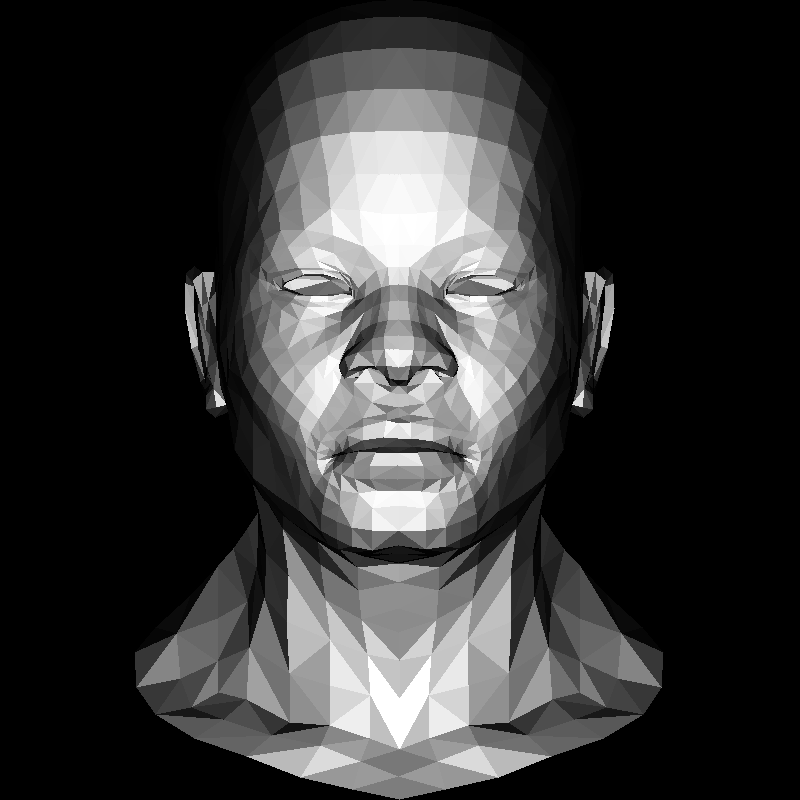

# ssloy_software_renderer

My code until the 5th lesson (inclusive) based on the tutorial:
https://github.com/ssloy/tinyrenderer/wiki/Lesson-0-getting-started

The code hasn't been optimized for readability, performance, or a nice architecture.
It's very much a quick and dirty look at the tutorial.

Pros:
- the topics
- focus on easy topics without going into too many details
- should work reasonably for beginners

Cons:
- goes into details over unimportant topics (e.g. scanline rendering & Bresenham) - detracts from what is supposedly the main goal
- provides too few details and motivation at places
- needless abstraction for some algorithms which detracts from the main idea

Results:

